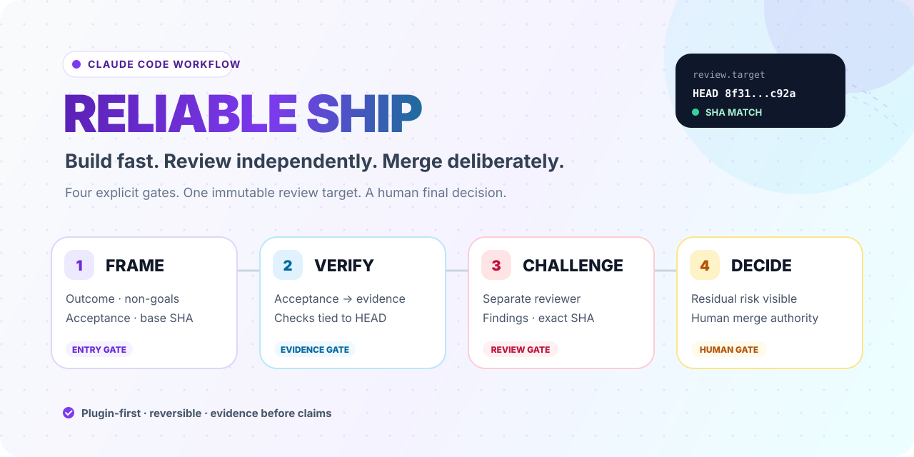
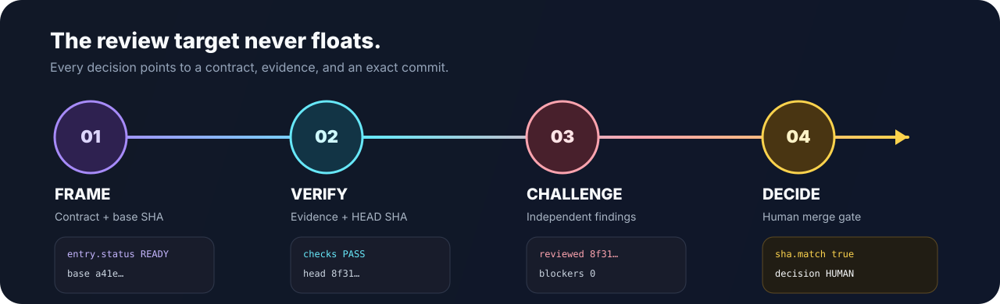

<picture>
  <source media="(prefers-color-scheme: dark)" srcset="./assets/hero-dark.svg">
  <source media="(prefers-color-scheme: light)" srcset="./assets/hero-light.svg">
  
</picture>

<h1 align="center">Reliable Ship</h1>

<p align="center"><strong>A reviewable Claude Code workflow for software you intend to ship.</strong></p>

<p align="center">
  Claude implements. A separate reviewer challenges. A human decides.
</p>

<p align="center">
  <a href="README.md">English</a> · <a href="README.ja.md">日本語</a>
</p>

<p align="center">
  <a href="https://github.com/tatsunoritojo/claude-code-project-starter/actions/workflows/ci.yml"></a>
  
  
  <a href="LICENSE"></a>
</p>

---

Claude Code can move quickly. Speed becomes useful only when everyone can answer four questions:

1. What exactly did we agree to change?
2. What evidence proves the current commit?
3. Did a separate reviewer challenge that exact commit?
4. Who owns the final merge or release decision?

Reliable Ship turns those questions into four explicit skills. It is intentionally smaller than a specification framework and stricter than a prompt collection.

## Install in two commands

Run these inside Claude Code:

```text
/plugin marketplace add tatsunoritojo/claude-code-project-starter
/plugin install reliable-ship@tojo-ai-workflows
```

Then reload plugins if Claude Code asks you to:

```text
/reload-plugins
```

> [!NOTE]
> The plugin contains four Markdown skills and four Markdown templates. It adds no hooks, MCP servers, binaries, background processes, or automatic merge behavior.

## Use the four gates

| Gate | Command | Produces | Stops when |
|---|---|---|---|
| Frame | `/reliable-ship:frame` | Outcome, non-goals, acceptance checks, base SHA | Scope or authority is ambiguous |
| Verify | `/reliable-ship:verify` | Acceptance-to-evidence map tied to HEAD | Evidence is missing or contradictory |
| Challenge | `/reliable-ship:review-brief` | Self-contained brief for Codex or another separate reviewer | Verification is missing or stale |
| Decide | `/reliable-ship:merge-gate` | Current evidence, findings, residual risk, human decision surface | Reviewed SHA and current HEAD differ |

<p align="center">
  
</p>

The normal sequence is:

```text
/reliable-ship:frame
# Claude Code implements the accepted change
/reliable-ship:verify
/reliable-ship:review-brief
# Give the brief to Codex or another independent reviewer
/reliable-ship:merge-gate
# A human chooses merge, revise, or hold
```

### The invariant

Verification and review are valid only for the clean commit SHA they name. Uncommitted changes cannot inherit that evidence. If HEAD or the worktree changes, the affected gate must run again after the work is committed.

This is designed to block a common failure mode at the gate: an agent receives approval, changes the code afterward, and lets the old approval appear to cover the new state.

## What the plugin will and will not do

| It will | It will not |
|---|---|
| Keep one change human-sized | Invent a full product specification |
| Require observable acceptance evidence | Treat “should work” as proof |
| Prepare a neutral independent-review packet | Call Claude's self-review independent |
| Detect stale reviewed SHAs | Carry approval across later commits |
| Make residual risk visible | Merge, release, or deploy for the human |

Reliable Ship can prepare a handoff for Codex, but it does not call Codex itself. Independence comes from using a genuinely separate review context, not from changing the label on the same agent.

## Start a repository with the same gates

The [`project-template/`](project-template/) directory adds the repository-side pieces:

- a concise project `CLAUDE.md`;
- one-page `docs/01-overview.md`;
- append-only architecture decision records;
- session-start context;
- a human-sized AI change Issue form;
- a pull request template with evidence, reviewed SHA, and human merge fields.

Copy it into a new or existing repository and replace the placeholders.

**macOS / Linux**

```bash
cp -R project-template/CLAUDE.md \
  project-template/docs \
  project-template/.claude \
  project-template/.github \
  /path/to/your-project/
```

**Windows PowerShell**

```powershell
Copy-Item -Recurse `
  project-template\CLAUDE.md, `
  project-template\docs, `
  project-template\.claude, `
  project-template\.github `
  C:\path\to\your-project\
```

The plugin never copies these files automatically. You choose what enters a repository.

This repository mirrors the same Issue and pull request templates under `.github/`, so the workflow is used to maintain itself.

## Evidence, not slogans

### Public case study

[MacKairu: changing a native macOS app without losing control](docs/case-study-mackairu.md) traces a public sequence that:

- fixes a Japanese IME defect;
- splits a 666-line view and a 1,196-line state object;
- keeps intended behavior stable across structural phases;
- moves pure logic into direct tests, increasing the reported test count from 58 to 69;
- records build, test, and Codex-review checkpoints in public commits.

The case study also states its limits: the history is observational, full review transcripts are not public, and no productivity percentage is claimed.

### Reproducible evaluation

The [`evals/`](evals/) kit defines matched control/plugin scenarios for:

- scope drift;
- unsupported completion claims;
- stale review SHAs;
- fake review independence;
- silent transfer of merge authority to AI.

Published result status: **not measured yet**. The protocol and raw-result format ship before any behavioral claim.

### Automated repository checks

CI currently checks:

- Linux and Windows install/uninstall behavior for the full style pack;
- preservation of pre-existing rules, settings, same-name skills, and hooks;
- JSON syntax and skill frontmatter;
- marketplace/plugin structure;
- required workflow and project templates;
- shell script errors;
- accidental personal or client identifiers.

## Advanced: install the full style pack

The plugin is the recommended public entry point. The original full pack remains for users who also want global Claude Code rules, fourteen Japanese workflow skills, project defaults, and a session-start greeting.

Clone or download the repository, then run:

**Windows PowerShell**

```powershell
.\install.ps1
# Optional profile values:
.\install.ps1 -UserName "Your name" -UserRole "Backend engineer"
```

**macOS / Linux**

```bash
bash install.sh
# Optional profile values:
USER_NAME="Your name" USER_ROLE="Backend engineer" bash install.sh
```

The installer is non-destructive by default:

- existing `CLAUDE.md` and `settings.json` are written as `.stylepack` side files;
- existing same-name skills are skipped;
- an existing same-name hook is skipped;
- forced replacements are backed up;
- an install manifest limits what uninstall may remove;
- uninstall is a dry run unless explicitly confirmed.

<details>
<summary><strong>Full-pack uninstall</strong></summary>

**Windows**

```powershell
.\uninstall.ps1
.\uninstall.ps1 -Yes
```

**macOS / Linux**

```bash
bash uninstall.sh
YES=1 bash uninstall.sh
```

`CLAUDE.md` and `settings.json` are not deleted automatically because they may contain user edits.

</details>

## Repository map

```text
.
├── .claude-plugin/             # Marketplace catalog
├── plugins/reliable-ship/      # Four Markdown-only workflow skills
├── project-template/           # CLAUDE.md, docs, Issue, and PR starter
├── home-claude/                # Advanced full style pack (14 skills)
├── evals/                      # Reproducible behavioral evaluation kit
├── docs/                       # Overview, case study, and ADRs
├── assets/                     # Light/dark hero, workflow, social preview
├── install.* / uninstall.*     # Safe full-pack installers
└── scripts/                    # Repository validation and anonymization
```

## Design principles

- **Small contracts beat giant issues.** Capture only what changes implementation or approval.
- **Evidence beats confidence.** “Done” is a claim until checks support it.
- **Review targets are immutable.** Approval belongs to a SHA, not a branch name.
- **Different roles need different context.** Implementation and refutation should not share assumptions by default.
- **Humans retain authority.** AI can recommend; it does not inherit merge or release ownership.

## Documentation

- [Project overview](docs/01-overview.md)
- [MacKairu case study](docs/case-study-mackairu.md)
- [Evaluation protocol](evals/README.md)
- [Architecture decisions](docs/decisions/)
- [Contributing](CONTRIBUTING.md)
- [Security](SECURITY.md)

## License

MIT. See [`LICENSE`](LICENSE). Some full-pack skills adapt earlier MIT-licensed work; their individual `SKILL.md` files retain origin notes.
