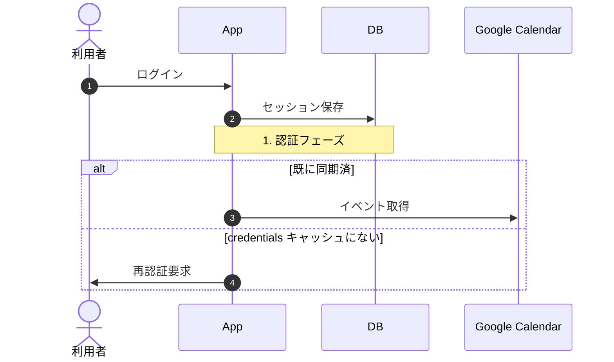
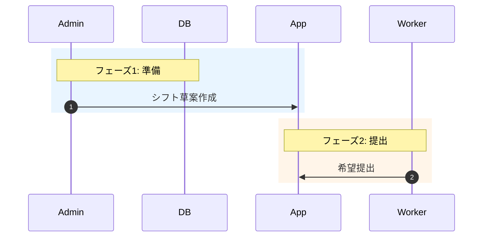

# Mermaid Sequence Diagram

アプリケーションの動作フローをmermaidシーケンス図で可視化するスキル。複数プロジェクトでの可視化作業を通じて固めた定型プロセスを再現する。

## 起動条件

- 「シーケンス図を描いて」「mermaidでフローを可視化して」「動作フローをmermaidに」等のトリガー
- 既存ドキュメントに `docs/sequence-diagrams/` が無いか不足しているプロジェクトで、可視化が必要なとき
- LP・提案書のfact-review、アーキテクチャ説明、引き継ぎ用の根拠ドキュメントが必要なとき

## 大原則

1. **コードを読まずに描かない** — メモリ・引き継ぎメモ・サブエージェントの報告書だけで描かない。blueprint / route / service層は自分で交差読みする。**フロントエンドJSの並行API呼び出しや外部連携も明示的に拾う**（フロントの並行 API 呼び出しや外部サービス連携の存在を実装で見落とすと、後日のfact-reviewで誤判定が出やすい）
2. **1枚絵にしない** — 全フローを1枚に詰め込むと読めない。ステージ分割 + 1ファイル多図構成で書く
3. **個別 → 俯瞰の順序** — 俯瞰先行は「こうなっているはず」の想像で箱が並ぶ。個別を先に描き切ってから俯瞰でつなぐ
4. **ロール × ステージで章立てする** — フロー単位ではなく、人間の関わり方を起点に章立てする
5. **末尾に必ず「実装根拠ファイルパス」と「ユーザー体験サマリー表」を添える** — 後日fact-reviewに使える信頼性を確保

## 実行フロー

### Step 1: 範囲提案

依頼が来たら即座に「全部1枚は無理」と伝え、5〜7本の主要フロー候補を提示する。コードベースの規模に応じて候補を作る（CLAUDE.md / docs/01-overview.md / blueprint・controller のディレクトリ構成から推論）。

提示形式:

```
全部を1枚に描くと読みにくくなります。以下の候補から選んでもらうか、
全部やるなら個別図 + 俯瞰図で複数ファイルに分けます。

候補:
- オンボーディング（招待 → 初回ログイン → ロール付与）
- <Worker系のメインフロー>
- <Owner系のメインフロー>
- <Admin系のメインフロー>
- <外部連携・Cron系>
- <欠員募集・通知などサブフロー>
- 全体俯瞰図

どれを描きますか？全部 or 主要のみ?
```

### Step 2: 順序の確認

ユーザーが「個別 → 俯瞰」「俯瞰 → 個別」のどちらが良いか迷ったら、以下を提示:

> 個別 → 俯瞰をおすすめします。俯瞰を先に描くと「こうなっているはず」という想像で箱を並べがちで、後から個別図を描くと齟齬が出て直しが入ります。

### Step 3: 3点質問の固定セット

範囲が決まったら以下の3点を質問:

1. **出力先** — `docs/sequence-diagrams/` を新設（推奨）/ 既存ファイルに追記 / チャットに表示のみ
2. **読み手と粒度** — 業務利用レベル / エンジニア向けの細かい粒度 / 主要分岐のみ＋詳細は省略
3. **対象フローの最終確定** — Step 1 で提示した候補から確定させる

ユーザーが「人間がどう関わっているかを明確にしたい」「利用者の体験の切り口があってもいい」と言ったら、即座に **フロー単位ではなくロール単位 + ステージ分割** に章立てを組み替える。

### Step 4: コードベース調査（メイン文脈を汚さない）

まず Explore サブエージェントに以下を指示:

```
メモリではなく実コードを根拠にしてほしい。
「ユーザーの操作 → HTTPエンドポイント → service層 → model/DB → 外部」の順に
アクター・イベント・分岐を抽出してほしい。

特に注意してほしい点:
- フロントエンドJS（worker-app.js等）で並行発火するAPIも明示的に拾うこと
- Cron / Background Job / Queue 経由の処理も漏らさないこと
- 認証フローと業務フローを分離して整理すること
- メモリ・既存ドキュメントの記述ではなく、実装ファイルのパスと行番号を根拠にすること
```

サブエージェント完了後、メイン側で以下を直接Read（精度を上げるため）:

- 該当 blueprint / route ファイル（HTTPエンドポイントの実体）
- 該当 service ファイル（ビジネスロジック）
- フロントエンドの該当 JS（並行API呼び出し・キャッシュ層・SDK経由の外部呼び出しの確認）

### Step 5: TaskCreate でファイルごとに分解

1ファイル1タスクで TaskCreate する。例:

- 調査タスク（Step 4）
- 個別図1: オンボーディング
- 個別図2: <Roleの月次フロー>
- 個別図3: <Roleの承認フロー>
- ...
- 俯瞰図（最後）
- README.md（索引表）

完了するごとに TaskUpdate で completed 化する。

### Step 6: 各ファイルを生成

ファイル構成（1ファイルのテンプレート）:

````markdown
# <フロー名>

## 登場する人間
- **<Role A>** — <役割の説明>
- **<Role B>** — ...

## ステージ1: <名前>
（説明文 1〜2行）



## ステージ2: <名前>

```mermaid
sequenceDiagram
  autonumber
  ...
```

## 実装根拠

- `app/blueprints/api_xxx.py` — エンドポイント実装
- `app/services/xxx_service.py` — ビジネスロジック
- `static/js/worker-app.js` — フロント並行呼び出し（`fetchAndCacheEvents` 等）

## ユーザー体験サマリー

| 段階 | 人間の操作 | システムが返すもの |
|---|---|---|
| 1 | ログインボタンを押す | OAuth画面へリダイレクト |
| 2 | Googleで認可する | カレンダーが同期される |
| ... | ... | ... |
````

### Step 7: 俯瞰図 と README.md の作成

個別図を全部描き終わってから、最後に俯瞰図を作る。`rect rgba(R,G,B,A)` でフェーズ別ハイライトを使うと読みやすい:



`docs/sequence-diagrams/README.md` に索引表を作る:

```markdown
# シーケンス図一覧

| # | ファイル | 対象 | 主要アクター |
|---|---|---|---|
| 0 | 00-overview.md | 全体俯瞰 | 全員 |
| 1 | 01-onboarding.md | オンボーディング | NewUser, Inviter |
| 2 | 02-worker-monthly-flow.md | Worker月次フロー | Worker |
| ... | ... | ... | ... |
```

## mermaid記法規約

### actor / participant の分離

- `actor` = 人間。役割名（英語）+ `as` で日本語ラベル
  - 例: `actor Inviter as 招待者 (Admin)`
  - 例: `actor Worker as 勤務者`
- `participant` = システム
  - 例: `participant Cron as Vercel Cron`
  - 例: `participant Google as Google Calendar`
  - 例: `participant DB`（DBは説明不要なら as 省略可）
  - 例: `participant App`（自アプリは `App` で統一。固有名は使わない）

### 必須要素

- `autonumber` をすべての図で使う
- `Note over X,Y: <章節タイトル>` で章節区切り
- 分岐は `alt` / `else` / `loop`
- 俯瞰図のフェーズハイライトは `rect rgba(R,G,B,A)`

### 言語

- **コメント・ラベル・章節タイトルはすべて日本語**
- 識別子（actor名、participant名）は英語、`as` で日本語ラベルを付与

### 1ファイル多図構成

1枚の `sequenceDiagram` ブロックに詰め込まない。**ステージ分割で複数ブロックを段落分け** で並べる。1ブロックあたり10〜20メッセージが上限の目安。それを超えたら分割する。

## Step 8: README 連携の提案（任意・連鎖）

個別図 + 俯瞰図 + `docs/sequence-diagrams/README.md`（索引）を作成し終わったら、`AskUserQuestion` で以下を確認:

> 「シーケンス図一式を作成しました。これを活用して、リポジトリの README をポートフォリオ・対外公開向けに書き直しますか？」

選択肢:
- 「はい、続けて `/readme-portfolio` を実行する（推奨）」 — `Skill` tool で `readme-portfolio` を起動。連鎖時は `docs/sequence-diagrams/` の整備状況が既知なので、`/readme-portfolio` 側の「シーケンス図整備状況の確認」ステップは自動的にスキップされ、Step 10「既存シーケンス図の活用」が有効化される
- 「いいえ、シーケンス図だけで終わる」 — 通常終了

このステップは任意。図の作成自体が目的だった場合は、ユーザーが「いいえ」を選べばここで終了する。

## VSCode でmermaidが描画されないとき

Markdownプレビューでmermaidが描画されない場合、拡張機能 `bierner.markdown-mermaid` を案内する:

```
VSCodeのMarkdownプレビューでmermaidを表示するには、
拡張機能 `Markdown Preview Mermaid Support`（bierner.markdown-mermaid）が必要です。
インストール後にプレビューを開き直してください。
```

## 注意点

- **「動くはず」で図を作らない** — 必ず実コードで検証してから。外部サービスとの Free/Busy 連動のような並行処理の存在を実装で見落とすと、後日のfact-reviewで誤判定が出やすい
- **メモリ・引き継ぎメモ・既存ドキュメントを鵜呑みにしない** — 一次情報（実コード）で検証する
- **各ファイル末尾に「実装根拠ファイルパス」を残す** — 後日fact-reviewするときの信頼性が変わる。サブエージェントの報告書ではなく、自分でRead確認したファイルのみ列挙する
- **ロール定義が薄いプロジェクトでは、まず `<project>/CLAUDE.md` または `docs/01-overview.md` のロール定義を整備する** — 不明確なまま図を描くと精度が出ない。`design-actor-impact` スキルが補助になる
- **大改訂が必要になったら新ファイルを切る** — グローバルルール「ad-hocドキュメントの命名規則」を継承するが、シーケンス図ファイル名は `00-overview.md` `01-onboarding.md` のような連番制を維持する（時系列ソートではなく構造ソート優先のため、日付プレフィックスは付けない）

## 関連スキル・ルール

- **`design-actor-impact`** — アクター定義が薄いときの補助。先にロール定義を整備してから本スキルを実行する
- **`doc-init`** — `docs/sequence-diagrams/` の親ディレクトリ `docs/` の整備状態確認に使う
- **グローバル CLAUDE.md「コードベース検証時の視点」** — Step 4 の根拠
- **グローバル CLAUDE.md「一次資料・ファクトチェック原則」** — 「動くはず」で図を作らない理由の根拠
